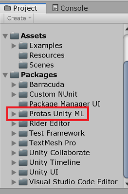

# Unity ML Agents Package #

## About this repository ##

The repository is a modified version of [Unity's ml-agents v0.12](https://github.com/Unity-Technologies/ml-agents/releases/tag/0.12.0) that can be used in Project Protas.

## Set up ##

To use it, in the `\Packages\manifest.json`, add the `com.protas.unityml` dependency.

    {
        "dependencies": {
            "com.protas.unityml": "https://github.com/projectprotas/UnityMlAgentsPackage.git",
            ...
        }
    }

You are required to have Python 3.6.X ([3.6.6](https://www.python.org/downloads/release/python-366/) recommended for consistency in Protas Projects) installed due to compatibility issues. Python 3.5 or below and Pyhton 3.8 or greater do not work. Python 3.7 may work, but has not been fully tested.

You are also required to install `ml-agents`

    pip3 install mlagents

Installing mlagents will install **all** other python dependencies.

This should result in `Protas Unity ML` being added to the packages section in the project explorer.

## Additional Notes ##

You do not need to add the `com.unity.barracuda` dependency as this package adds the correct version for you.

Some of the meta files share the same GUID as the ones from the ml-agents repository as they have been copied out of there.

Some of the meta files do not share the same GUID, so you may find a few occurances of missing scripts on the Unity interface.

For this reason **do not** have a copy of the following folders in your Unity project (this package will sort all these folders)

* \ml-agents-0.12.0\config\
* \ml-agents-0.12.0\gym-unity\
* \ml-agents-0.12.0\ml-agents\
* \ml-agents-0.12.0\ml-agents-envs\
* \ml-agents-0.12.0\notebooks\
* \ml-agents-0.12.0\protobuf-definitions\
* \ml-agents-0.12.0\utils\
* \ml-agents-0.12.0\UnitySDK\Assets\ML-Agents\Editor\
* \ml-agents-0.12.0\UnitySDK\Assets\ML-Agents\Scripts\
* \ml-agents-0.12.0\UnitySDK\Assets\ML-Agents\Plugins\
* \ml-agents-0.12.0\UnitySDK\Assets\ML-Agents\Examples\SharedAssets\

For more information on how to use Unity's ml-agents see their [documentation home](https://github.com/Unity-Technologies/ml-agents/blob/master/docs/Readme.md).
